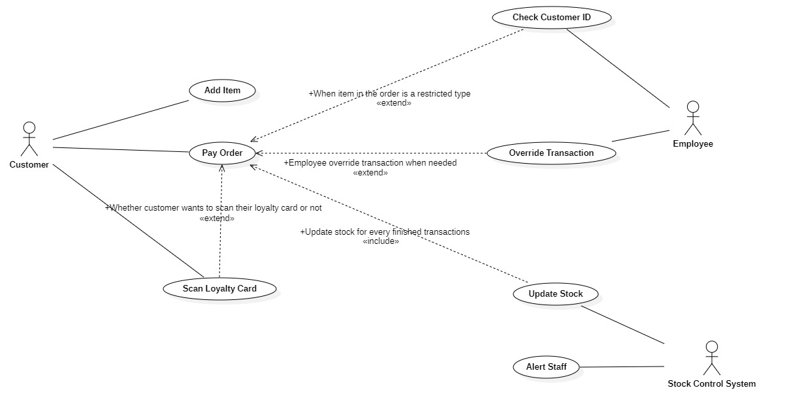

In one assignment, I have to design a Class diagram with a scenario of a self-service checkout system for a supermarket. But before we jumped into creating the diagram, it is best to identify the actor first and map what activities they can do based on the scenario above. It pictures not only the activities, but also to whom they are connected to. Below is the use-case diagram I made.

Based on the use-case diagram, I tried to draft classes that should exists as well as relationship. I this step is an abstract process, you can get different design when you ask different people. No answer is the right answer, but to make every answer the right answer, it is best to state your reason _why this class should exists_.

As long as the statement is acceptable, and can fulfil the requirement of the scenario, that is the right answer coming from you. So, here is the class diagram that I made for this assignment.

Feedbacks that I got from my lecturer is that I should be adding the data type of each attribute as well as the returned value of each class's operations. I agree with him, as it makes the diagram even more clear. When I read further about it, I found that the type that we can set isn't limited to the _primitive_ type that we know from most programming language. Even a class that I define on my diagram can be used as the _type_.
