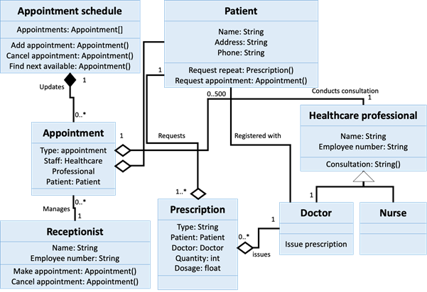

Previously, I wrote a post about how to create a Class diagram from a given scenario. In summary, to design a class diagram is to understand the scenario wholly and then be creative about it. And then turn my _extended_ imagination of the scenario, my justification and reasoning into a diagram.

Now, the new challenge is: how to make a program based on a Class diagram?

I was given this diagram as the scenario and asked to use Python to implement the diagram. In general, the steps I took are:

1. Identify the relationship
2. Create classes and their constructor first
3. Create the method for each class

Identifying the relationship first rather than classes will helped me to _measure_ the complexity of the program that I will create. Knowing its complexity will also help you in many other things, such as how you should organize the source code.

I ended up making one file for each classes, and keep them in a single folder. Keeping all the classes source code in a single folder helps me to efficiently manage the code. When I wrote the code, I had to go back and forth, switching from source to diagram. By isolating what I'm viewing in my code editor, I was able to focus and not feel overwhelmed by many lines of code. Although, the caveat is that the `main.py`, which the main code for the program, ended up being having so many imports.

I received several feedbacks from my lecturer. Two important things that I would like to mention is that:

1. Code should be self-explanatory.
2. The testing will be better if using the `unittest` library.

At first, I tried to understand what _self-explanatory_ means. I googled and found what my lecturer meant.

In this [blog post](https://futurice.com/blog/self-explanatory-code) written by Kevin and [this answer](https://stackoverflow.com/a/209089) on StackOverflow by user ine, their arguments are pointing to the same thing: that code should be having no-comments at all, but people are still understand it. This doesn't mean to not comment the code at all. Rather, there are several things that we can do first, before _removing all comments_ from the code.

Kevin said that to make sure that the code is self-explanatory, the same logic should be tested in different ways: **source code**, **documentation**, and **tests** (unit testing). The reason why it is not enough to just do one logic test, Kevin shared a story where unit testing is 100% passed, but products the customer ordered are not delivered. The culprit was found after drawing a simple sequence diagram and bug fix is delivered.